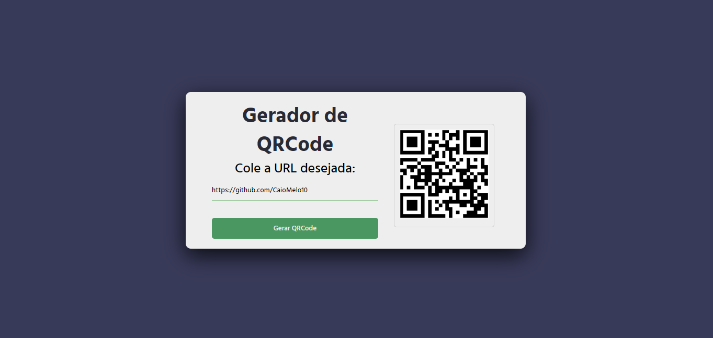

## Geração de QR Code

Este aplicativo utiliza um serviço de terceiros para gerar QR codes com base nas URLs inseridas pelo usuário. A API responsável pela geração dos QR codes é fornecida pelo [QRServer](https://api.qrserver.com/).
## Tecnologias Utilizadas

- [ReactJS](https://reactjs.org/): Uma biblioteca JavaScript para construção de interfaces de usuário.
- CSS: Estilização das páginas.
- Além disso, o aplicativo utiliza a API do [QRServer](https://api.qrserver.com/) para a geração dinâmica de QR codes.

👥 Confira:

https://geradordeqrcode-dev.netlify.app/

